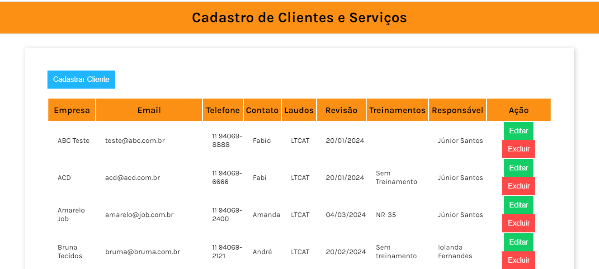
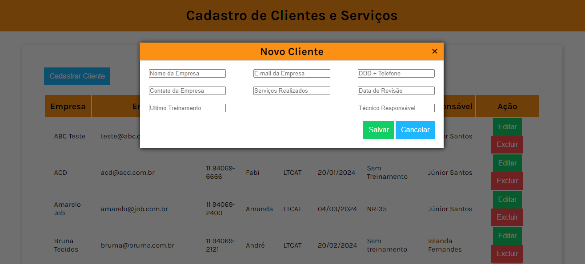
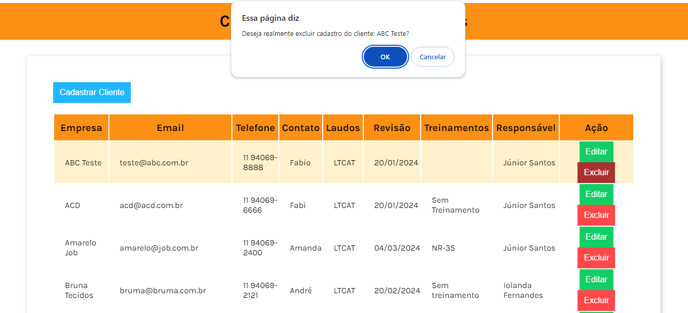

# CRUD - Cadastro

#### O projeto CRUD - Casdatro foi desenvolvido com o objetivo de criar uma página de cadastro e controle fácil. Esse projeto está sendo desenvolvido para uma empresa real e a exigência do cliente era que a página contivesse as informações mais relevantes de seus cientes e serviços realizados, para que assim eles pudessem ter um melhor controle e com isso também facilitar o trabalho de fidelização de seus clientes.

## Segue abaixo layout da aplicação:

## Projeto criado por:

---

## Contato

## Linguagens

